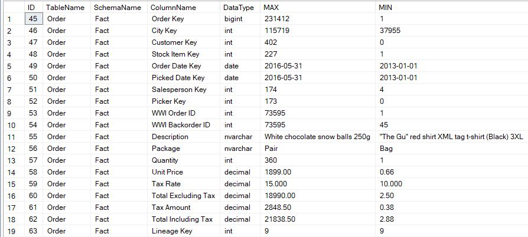

# SCOUTS-DATA-PROFILER
A flexible pure T-SQL data profiler

### Install

Run the ```adopt SCOUT_Data_Profiler.sql``` script. You will need to have rights to create a:
* Schema
* UDF Table Type
* Stored Procedure 

### How to use the SCOUTS profiler:
```SQL
--Setup templates
DECLARE @Template SCOUT.Templates

INSERT INTO @Template VALUES ('MAX', 'SELECT MAX(<C>) AS [Max] FROM <T>')
INSERT INTO @Template VALUES ('MIN', 'SELECT MIN(<C>) AS [Min] FROM <T>')

--Run the profiler
EXEC [SCOUT].[SCOUTS_Data_Profiler]
	@Database = 'WideWorldImportersDW-Standard',
	@SCHEMA = 'Fact',
	@TABLE = 'Order',
	@Templates_as_ref = @Template
```
The above yields:


A template is a small SQL query that returns one column and one row. The ```<C>``` represent a column and ```<T>``` represent a table. The profiler will run the template on each column of the table that are passed to it.

For more example of templates to use: ```example_template.sql```.